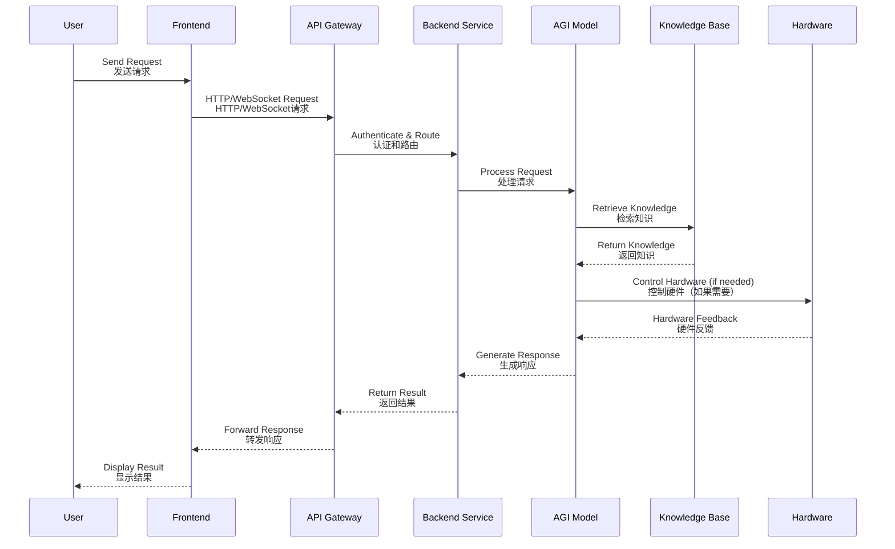

# System Architecture | 系统架构

This document describes the overall architecture of the Self AGI system, including the four-layer design, core components, data flow, and system interactions.

本文档描述 Self AGI 系统的整体架构，包括四层设计、核心组件、数据流和系统交互。

## Architecture Overview | 架构概述

The Self AGI system adopts a **four-layer architecture design** that separates concerns and provides clear interfaces between different system components.

Self AGI 系统采用**四层架构设计**，分离关注点，并在不同系统组件之间提供清晰的接口。

### Four-Layer Architecture | 四层架构

```mermaid
graph TB
    %% Layer 1: Frontend Interface
    subgraph L1 [Frontend Interface Layer | 前端界面层]
        FE1[Video Chat | 视频对话]
        FE2[Text Processing | 文本处理]
        FE3[Hardware Management | 硬件管理]
        FE4[Knowledge Base | 知识库]
        FE5[Training Monitoring | 训练监控]
    end

    %% Layer 2: Backend Service
    subgraph L2 [FastAPI Backend Service Layer | FastAPI后端服务层]
        BE1[User Authentication | 用户认证]
        BE2[API Management | API管理]
        BE3[Model Service | 模型服务]
        BE4[Payment Integration | 支付集成]
        BE5[Training Scheduling | 训练调度]
        BE6[Hardware API | 硬件API]
    end

    %% Layer 3: AGI Core Engine
    subgraph L3 [AGI Core Model Engine Layer | AGI核心模型引擎层]
        AI1[Transformer Core | Transformer核心]
        AI2[Memory System | 记忆系统]
        AI3[Knowledge Base Engine | 知识库引擎]
        AI4[Multimodal Fusion | 多模态融合]
        AI5[Control Center | 控制中心]
    end

    %% Layer 4: Hardware Control
    subgraph L4 [Hardware Control & Simulation Layer | 硬件控制与仿真层]
        HW1[PyBullet Simulation | PyBullet仿真]
        HW2[Gazebo Simulation | Gazebo仿真]
        HW3[Motion Control | 运动控制]
        HW4[Sensors | 传感器]
        HW5[Motor Control | 电机控制]
        HW6[Hardware Abstraction | 硬件抽象层]
    end

    %% Data Flow
    FE1 -- HTTP/WebSocket --> BE1
    FE2 -- HTTP/WebSocket --> BE2
    FE3 -- HTTP/WebSocket --> BE3
    FE4 -- HTTP/WebSocket --> BE4
    FE5 -- HTTP/WebSocket --> BE5
    
    BE1 -- gRPC/HTTP --> AI1
    BE2 -- gRPC/HTTP --> AI2
    BE3 -- gRPC/HTTP --> AI3
    BE4 -- gRPC/HTTP --> AI4
    BE5 -- gRPC/HTTP --> AI5
    BE6 -- gRPC/HTTP --> AI5
    
    AI1 -- Hardware Interface --> HW1
    AI2 -- Hardware Interface --> HW2
    AI3 -- Hardware Interface --> HW3
    AI4 -- Hardware Interface --> HW4
    AI5 -- Hardware Interface --> HW5
    
    HW1 -- Sensor Data --> AI1
    HW2 -- Sensor Data --> AI2
    HW3 -- Feedback --> AI3
    HW4 -- Feedback --> AI4
    HW5 -- Feedback --> AI5
```

## Layer 1: Frontend Interface Layer | 第1层：前端界面层

### Purpose | 目的
Provides user interaction interfaces for AGI functions including video chat, text processing, hardware management, knowledge base access, and training monitoring.

提供AGI功能的用户交互界面，包括视频对话、文本处理、硬件管理、知识库访问和训练监控。

### Components | 组件
- **Video Chat Interface**: Real-time video communication with AGI
- **Text Processing Interface**: Text input and response display
- **Hardware Management Interface**: Robot control and sensor monitoring
- **Knowledge Base Interface**: Knowledge search and management
- **Training Monitoring Interface**: Training progress and metrics visualization

- **视频对话界面**: 与AGI的实时视频通信
- **文本处理界面**: 文本输入和响应显示
- **硬件管理界面**: 机器人控制和传感器监控
- **知识库界面**: 知识搜索和管理
- **训练监控界面**: 训练进度和指标可视化

### Technologies | 技术
- React 18 with TypeScript 5.0
- Tailwind CSS for styling
- WebSocket for real-time communication
- Chart.js for data visualization

## Layer 2: FastAPI Backend Service Layer | 第2层：FastAPI后端服务层

### Purpose | 目的
Handles HTTP/WebSocket requests, manages user authentication, API routing, business logic, and integrates with external services.

处理HTTP/WebSocket请求，管理用户认证、API路由、业务逻辑，并与外部服务集成。

### Components | 组件
- **Authentication Service**: User login, registration, 2FA management
- **API Gateway**: Request routing, rate limiting, response caching
- **Model Service**: AGI model loading, inference, and management
- **Training Service**: Training task scheduling and monitoring
- **Hardware Service**: Hardware device management and control
- **Payment Service**: Payment processing integration (optional)

- **认证服务**: 用户登录、注册、双因素认证管理
- **API网关**: 请求路由、速率限制、响应缓存
- **模型服务**: AGI模型加载、推理和管理
- **训练服务**: 训练任务调度和监控
- **硬件服务**: 硬件设备管理和控制
- **支付服务**: 支付处理集成（可选）

### Technologies | 技术
- FastAPI 0.104.0 with Python 3.9+
- SQLAlchemy ORM for database operations
- Redis for caching and session management
- JWT for authentication tokens
- WebSocket for real-time bidirectional communication

## Layer 3: AGI Core Model Engine Layer | 第3层：AGI核心模型引擎层

### Purpose | 目的
Implements the core AGI intelligence including Transformer models, memory systems, knowledge base, multimodal fusion, and control logic.

实现核心AGI智能，包括Transformer模型、记忆系统、知识库、多模态融合和控制逻辑。

### Components | 组件

#### Transformer Core | Transformer核心
- **Architecture**: 12-layer Transformer with 768 hidden dimensions
- **Attention**: FlashAttention-2 for efficient attention computation
- **State Space Models**: Mamba-2 for linear complexity sequence processing
- **Mixture of Experts**: 8 expert networks with intelligent routing

- **架构**: 12层Transformer，768隐藏维度
- **注意力**: FlashAttention-2高效注意力计算
- **状态空间模型**: Mamba-2线性复杂度序列处理
- **混合专家系统**: 8个专家网络，智能路由

#### Memory System | 记忆系统
- **Hierarchical Memory**: Long-term, short-term, and working memory
- **Vector Retrieval**: FAISS/HNSW for efficient similarity search
- **Memory Compression**: Hierarchical attention and incremental updates
- **Importance Learning**: Access frequency and time decay based importance

- **分层记忆**: 长期、短期和工作记忆
- **向量检索**: FAISS/HNSW高效相似性搜索
- **记忆压缩**: 分层注意力和增量更新
- **重要性学习**: 基于访问频率和时间衰减的重要性评估

#### Knowledge Base Engine | 知识库引擎
- **Knowledge Storage**: Structured and unstructured knowledge storage
- **Semantic Search**: Vector-based semantic similarity search
- **Knowledge Graph**: Concept relationships and reasoning
- **Knowledge Validation**: Quality verification and consistency checking

- **知识存储**: 结构化和非结构化知识存储
- **语义搜索**: 基于向量的语义相似性搜索
- **知识图谱**: 概念关系和推理
- **知识验证**: 质量验证和一致性检查

#### Multimodal Fusion | 多模态融合
- **Cross-modal Attention**: Attention across different modalities
- **Hierarchical Fusion**: Multi-level feature fusion
- **Alignment Learning**: Contrastive learning for modality alignment
- **Feature Extraction**: Text, vision, audio, video, sensor encoders

- **跨模态注意力**: 不同模态间的注意力机制
- **分层融合**: 多级特征融合
- **对齐学习**: 模态对齐的对比学习
- **特征提取**: 文本、视觉、音频、视频、传感器编码器

#### Control Center | 控制中心
- **Planning System**: PDDL/HTN planning with A*, RRT, MPC algorithms
- **Reasoning Engine**: Logical, mathematical, causal, spatial reasoning
- **Self-Cognition**: Self-representation, meta-cognition, self-evaluation
- **Learning Controller**: Autonomous learning and adaptation control

- **规划系统**: PDDL/HTN规划，支持A*、RRT、MPC算法
- **推理引擎**: 逻辑、数学、因果、空间推理
- **自我认知**: 自我表示、元认知、自我评估
- **学习控制器**: 自主学习和适应控制

### Advanced Technologies | 先进技术
- **FlashAttention-2**: 8192 tokens context window, 50% memory reduction
- **FAISS/HNSW**: 10-100x faster vector retrieval
- **Mamba-2 State Space Models**: O(n) sequence processing complexity
- **Physics-Informed Neural Networks (PINN)**: Physics law constrained learning
- **Graph Neural Networks**: Graph Laplacian and spectral convolution

## Layer 4: Hardware Control & Simulation Layer | 第4层：硬件控制与仿真层

### Purpose | 目的
Provides hardware abstraction, robot control, sensor data acquisition, and simulation environments for testing and development.

提供硬件抽象、机器人控制、传感器数据采集以及测试和开发的仿真环境。

### Components | 组件

#### Simulation Environments | 仿真环境
- **PyBullet Simulation**: Physics-based robot simulation
- **Gazebo Simulation**: ROS 2 integrated simulation environment
- **Unified Interface**: Common API for both simulation and real hardware

- **PyBullet仿真**: 基于物理的机器人仿真
- **Gazebo仿真**: ROS 2集成仿真环境
- **统一接口**: 仿真和真实硬件的通用API

#### Hardware Control | 硬件控制
- **Robot Controller**: Joint position, velocity, torque control
- **Sensor Interface**: IMU, cameras, LiDAR, force-torque sensors
- **Motor Control**: PWM, CAN bus, serial communication
- **Hardware Abstraction**: Unified interface for different hardware platforms

- **机器人控制器**: 关节位置、速度、扭矩控制
- **传感器接口**: IMU、相机、激光雷达、力扭矩传感器
- **电机控制**: PWM、CAN总线、串口通信
- **硬件抽象**: 不同硬件平台的统一接口

#### Physical Modeling | 物理建模
- **Robot Dynamics**: Lagrangian and Hamiltonian dynamics models
- **Sensor Physics**: IMU noise models, camera projection models
- **Environment Interaction**: Collision detection, contact mechanics
- **Multi-physics Coupling**: Structural, thermal, fluid field coupling

- **机器人动力学**: 拉格朗日和哈密顿动力学模型
- **传感器物理**: IMU噪声模型、相机投影模型
- **环境交互**: 碰撞检测、接触力学
- **多物理场耦合**: 结构场、热场、流场耦合

## Data Flow | 数据流

### Request Processing Flow | 请求处理流程
1. **User Request**: User interacts with frontend interface
2. **API Gateway**: Request routed to appropriate backend service
3. **Service Processing**: Business logic execution and validation
4. **Model Inference**: AGI model processes the request
5. **Memory Retrieval**: Relevant memories retrieved from memory system
6. **Knowledge Query**: Knowledge base consulted for additional information
7. **Result Integration**: Results from multiple sources integrated
8. **Response Generation**: Final response generated and returned
9. **Frontend Display**: Response displayed to user

1. **用户请求**: 用户与前端界面交互
2. **API网关**: 请求路由到适当的后端服务
3. **服务处理**: 业务逻辑执行和验证
4. **模型推理**: AGI模型处理请求
5. **记忆检索**: 从记忆系统检索相关记忆
6. **知识查询**: 查询知识库获取附加信息
7. **结果整合**: 整合多个来源的结果
8. **响应生成**: 生成最终响应并返回
9. **前端显示**: 向用户显示响应

## Logical Runtime Architecture Diagram | 逻辑运行架构图

### Complete Runtime Architecture | 完整运行时架构

```mermaid
flowchart TB
    %% User Interaction
    User[User Interaction<br/>用户交互] --> Frontend
    
    %% Frontend Layer
    subgraph Frontend[Frontend Interface Layer<br/>前端界面层]
        FE_UI[UI Components<br/>UI组件]
        FE_State[State Management<br/>状态管理]
        FE_Comms[Communication<br/>通信层]
    end
    
    Frontend --> API_Gateway
    
    %% API Gateway Layer
    subgraph API_Gateway[API Gateway Layer<br/>API网关层]
        AG_Auth[Authentication<br/>认证]
        AG_Rate[Rate Limiting<br/>速率限制]
        AG_Route[Request Routing<br/>请求路由]
        AG_Cache[Response Caching<br/>响应缓存]
    end
    
    API_Gateway --> Backend_Services
    
    %% Backend Services Layer
    subgraph Backend_Services[Backend Services Layer<br/>后端服务层]
        BS_User[User Service<br/>用户服务]
        BS_Model[Model Service<br/>模型服务]
        BS_Training[Training Service<br/>训练服务]
        BS_Hardware[Hardware Service<br/>硬件服务]
        BS_Knowledge[Knowledge Service<br/>知识服务]
    end
    
    Backend_Services --> AGI_Core
    
    %% AGI Core Layer
    subgraph AGI_Core[AGI Core Engine Layer<br/>AGI核心引擎层]
        %% Sub-modules
        subgraph Core_Trans[Transformer Core<br/>Transformer核心]
            T_Encoder[Encoder Layers<br/>编码器层]
            T_Decoder[Decoder Layers<br/>解码器层]
            T_Attention[Multi-Head Attention<br/>多头注意力]
            T_FFN[Feed Forward Network<br/>前馈网络]
        end
        
        subgraph Core_Memory[Memory System<br/>记忆系统]
            M_LTM[Long-Term Memory<br/>长期记忆]
            M_STM[Short-Term Memory<br/>短期记忆]
            M_WM[Working Memory<br/>工作记忆]
            M_Retrieval[Memory Retrieval<br/>记忆检索]
        end
        
        subgraph Core_Knowledge[Knowledge Base Engine<br/>知识库引擎]
            K_Storage[Knowledge Storage<br/>知识存储]
            K_Graph[Knowledge Graph<br/>知识图谱]
            K_Search[Semantic Search<br/>语义搜索]
            K_Reasoning[Reasoning Engine<br/>推理引擎]
        end
        
        subgraph Core_Fusion[Multimodal Fusion<br/>多模态融合]
            F_Text[Text Encoder<br/>文本编码器]
            F_Vision[Vision Encoder<br/>视觉编码器]
            F_Audio[Audio Encoder<br/>音频编码器]
            F_Sensor[Sensor Encoder<br/>传感器编码器]
            F_Cross[Cross-Modal Attention<br/>跨模态注意力]
        end
        
        subgraph Core_Control[Control Center<br/>控制中心]
            C_Planning[Planning System<br/>规划系统]
            C_Reasoning[Reasoning Engine<br/>推理引擎]
            C_Learning[Learning Controller<br/>学习控制器]
            C_SelfCog[Self-Cognition<br/>自我认知]
        end
        
        %% Internal connections
        Core_Trans --> Core_Memory
        Core_Memory --> Core_Knowledge
        Core_Knowledge --> Core_Fusion
        Core_Fusion --> Core_Control
        Core_Control --> Core_Trans
        
        %% External interfaces
        Core_Trans --> Model_IO[Model I/O<br/>模型输入输出]
        Core_Control --> Hardware_Interface[Hardware Interface<br/>硬件接口]
    end
    
    AGI_Core --> Hardware_Layer
    
    %% Hardware Layer
    subgraph Hardware_Layer[Hardware Control Layer<br/>硬件控制层]
        HW_Sim[Simulation<br/>仿真环境]
        HW_Robot[Robot Control<br/>机器人控制]
        HW_Sensors[Sensor Interface<br/>传感器接口]
        HW_Actuators[Actuator Control<br/>执行器控制]
    end
    
    Hardware_Layer --> Real_World[Real World Environment<br/>真实世界环境]
    
    %% Data flow arrows
    Frontend -- HTTP/WebSocket --> API_Gateway
    API_Gateway -- Internal API Calls --> Backend_Services
    Backend_Services -- gRPC/HTTP --> AGI_Core
    AGI_Core -- Hardware Protocols --> Hardware_Layer
    Hardware_Layer -- Sensor Data --> AGI_Core
    
    %% Feedback loops
    Real_World -- Environment Feedback --> Hardware_Layer
    Hardware_Layer -- Performance Metrics --> Backend_Services
    Backend_Services -- Training Data --> AGI_Core
    AGI_Core -- Learning Updates --> Core_Control
```



### Logical Runtime Flow | 逻辑运行流程

#### 1. Request Processing Logic | 请求处理逻辑


#### 2. Learning Process Logic | 学习过程逻辑
```mermaid
flowchart LR
    subgraph LearningCycle[Learning Cycle | 学习周期]
        direction LR
        LC1[Data Collection<br/>数据收集] --> 
        LC2[Experience Formation<br/>经验形成] --> 
        LC3[Knowledge Extraction<br/>知识提取] --> 
        LC4[Model Update<br/>模型更新] --> 
        LC5[Performance Evaluation<br/>性能评估] --> 
        LC6[Adaptation<br/>适应调整]
    end
    
    Environment[Environment | 环境] -- Interaction --> LearningCycle
    LearningCycle -- Improved Behavior --> Environment
    
    subgraph MemoryFormation[Memory Formation | 记忆形成]
        direction TB
        MF1[Sensory Input<br/>感官输入] --> 
        MF2[Attention Filtering<br/>注意力过滤] --> 
        MF3[Working Memory<br/>工作记忆] --> 
        MF4[Consolidation<br/>巩固] --> 
        MF5[Long-Term Memory<br/>长期记忆]
    end
    
    LearningCycle -- Experience Data --> MemoryFormation
    MemoryFormation -- Retrieved Memories --> LearningCycle
```

#### 3. Real-World Interaction Logic | 真实世界交互逻辑
```mermaid
flowchart TD
    subgraph Perception[Perception Phase | 感知阶段]
        P1[Sensor Data Acquisition<br/>传感器数据采集]
        P2[Multimodal Fusion<br/>多模态融合]
        P3[Environment Understanding<br/>环境理解]
        P4[Object Recognition<br/>目标识别]
    end
    
    subgraph Cognition[Cognition Phase | 认知阶段]
        C1[Situation Assessment<br/>情境评估]
        C2[Goal Setting<br/>目标设定]
        C3[Planning<br/>规划]
        C4[Decision Making<br/>决策]
    end
    
    subgraph Action[Action Phase | 行动阶段]
        A1[Motor Planning<br/>运动规划]
        A2[Trajectory Generation<br/>轨迹生成]
        A3[Actuator Control<br/>执行器控制]
        A4[Motion Execution<br/>动作执行]
    end
    
    subgraph Learning[Learning Phase | 学习阶段]
        L1[Outcome Evaluation<br/>结果评估]
        L2[Error Analysis<br/>错误分析]
        L3[Knowledge Update<br/>知识更新]
        L4[Skill Improvement<br/>技能改进]
    end
    
    Perception --> Cognition
    Cognition --> Action
    Action --> Learning
    Learning --> Perception
    
    RealWorld[Real World | 真实世界] -- Sensor Data --> Perception
    Action -- Motor Commands --> RealWorld
    RealWorld -- Outcomes --> Learning
```

### System Runtime Characteristics | 系统运行时特征

#### Concurrency Model | 并发模型
- **Event-Driven Architecture**: Async I/O with asyncio and WebSockets
- **Worker Pools**: Multiple worker processes for CPU-intensive tasks
- **GPU Concurrency**: CUDA streams for parallel GPU operations
- **Distributed Processing**: Ray or Dask for distributed computation

- **事件驱动架构**: 使用asyncio和WebSocket的异步I/O
- **工作池**: 多个工作进程处理CPU密集型任务
- **GPU并发**: CUDA流实现并行GPU操作
- **分布式处理**: 使用Ray或Dask进行分布式计算

#### State Management | 状态管理
- **Session State**: Redis-based session storage with TTL
- **Model State**: Model parameters and activations in GPU memory
- **Memory State**: Vector embeddings in FAISS/HNSW indices
- **Hardware State**: Joint positions, velocities, sensor readings

- **会话状态**: 基于Redis的会话存储，带TTL
- **模型状态**: GPU内存中的模型参数和激活
- **记忆状态**: FAISS/HNSW索引中的向量嵌入
- **硬件状态**: 关节位置、速度、传感器读数

#### Resource Management | 资源管理
- **Memory Management**: Automatic garbage collection with manual GPU memory management
- **CPU Scheduling**: Process priority and affinity settings
- **GPU Scheduling**: Multi-GPU load balancing
- **Network Bandwidth**: QoS and traffic shaping

- **内存管理**: 自动垃圾回收与手动GPU内存管理
- **CPU调度**: 进程优先级和亲和性设置
- **GPU调度**: 多GPU负载均衡
- **网络带宽**: QoS和流量整形

#### Fault Tolerance | 容错能力
- **Graceful Degradation**: Fallback mechanisms when components fail
- **Checkpoint Recovery**: Automatic recovery from saved checkpoints
- **Health Monitoring**: Continuous health checks and automatic restart
- **Data Consistency**: ACID transactions for critical operations

- **优雅降级**: 组件故障时的回退机制
- **检查点恢复**: 从保存的检查点自动恢复
- **健康监控**: 连续健康检查和自动重启
- **数据一致性**: 关键操作的ACID事务

### Training Data Flow | 训练数据流
1. **Dataset Loading**: Multimodal datasets loaded from storage
2. **Preprocessing**: Data cleaning, augmentation, and normalization
3. **Model Forward**: Forward pass through AGI model
4. **Loss Computation**: Multiple loss terms computed
5. **Backward Pass**: Gradient computation and backpropagation
6. **Parameter Update**: Model parameters updated via optimizer
7. **Checkpointing**: Model checkpoints saved periodically
8. **Evaluation**: Model performance evaluated on validation set

1. **数据集加载**: 从存储加载多模态数据集
2. **预处理**: 数据清洗、增强和归一化
3. **模型前向**: 通过AGI模型前向传播
4. **损失计算**: 计算多个损失项
5. **反向传播**: 梯度计算和反向传播
6. **参数更新**: 通过优化器更新模型参数
7. **检查点保存**: 定期保存模型检查点
8. **评估**: 在验证集上评估模型性能

## System Interactions | 系统交互

### Module Dependencies | 模块依赖
```
Frontend ←HTTP/WS→ API Gateway ←Internal Calls→ Business Services
    ↓                           ↓
Hardware Control ←Hardware Interface→ Control Service → Planner
    ↓                           ↓
Sensor Data                Memory System → Knowledge Base
```

### Key Dependency Chains | 关键依赖链
1. **Model Inference Chain**: Input → Text/Vision Encoding → Transformer → Fusion Network → Output
2. **Training Optimization Chain**: Data → Preprocessing → Forward Pass → Loss Computation → Backward Pass → Parameter Update
3. **Hardware Control Chain**: Target → Path Planning → Inverse Kinematics → Trajectory Generation → Motor Control → Sensor Feedback
4. **Knowledge Management Chain**: Input → Semantic Analysis → Knowledge Retrieval → Association Reasoning → Result Integration

## Deployment Architecture | 部署架构

### Deployment Options | 部署选项
1. **Monolithic Deployment**: All services in single process (development)
2. **Containerized Deployment**: Docker containers with Kubernetes orchestration
3. **Microservices Deployment**: Services split and deployed independently
4. **Edge Deployment**: Lightweight version for edge devices

### High Availability Setup | 高可用性设置
- **Load Balancer**: Nginx or HAProxy for request distribution
- **Database Replication**: PostgreSQL master-slave replication
- **Redis Cluster**: Redis cluster for cache high availability
- **Monitoring Stack**: Prometheus and Grafana for system monitoring

## Performance Characteristics | 性能特征

### Model Performance | 模型性能
- **Inference Speed**: 100 tokens/second (CPU), 1000 tokens/second (GPU)
- **Memory Usage**: ~8GB model loading (FP32), ~16GB (training mode)
- **Training Speed**: 10,000 samples/hour (single GPU), 50,000 samples/hour (multi-GPU)

### System Performance | 系统性能
- **API Response Time**: <100ms (simple requests), <500ms (complex reasoning)
- **Concurrency Support**: 1000+ concurrent users
- **Data Throughput**: 10MB/second (multimodal data processing)
- **Availability**: 99.9% (with health checks and auto-recovery)

## Conclusion | 结论

The Self AGI system architecture provides a comprehensive, scalable, and high-performance foundation for autonomous general intelligence. The four-layer separation of concerns ensures maintainability and flexibility, while the integration of advanced AI technologies enables powerful AGI capabilities.

Self AGI 系统架构为自主通用智能提供了全面、可扩展和高性能的基础。四层关注点分离确保了可维护性和灵活性，而先进AI技术的集成则实现了强大的AGI能力。

---

*Last Updated: March 30, 2026*  
*最后更新: 2026年3月30日*